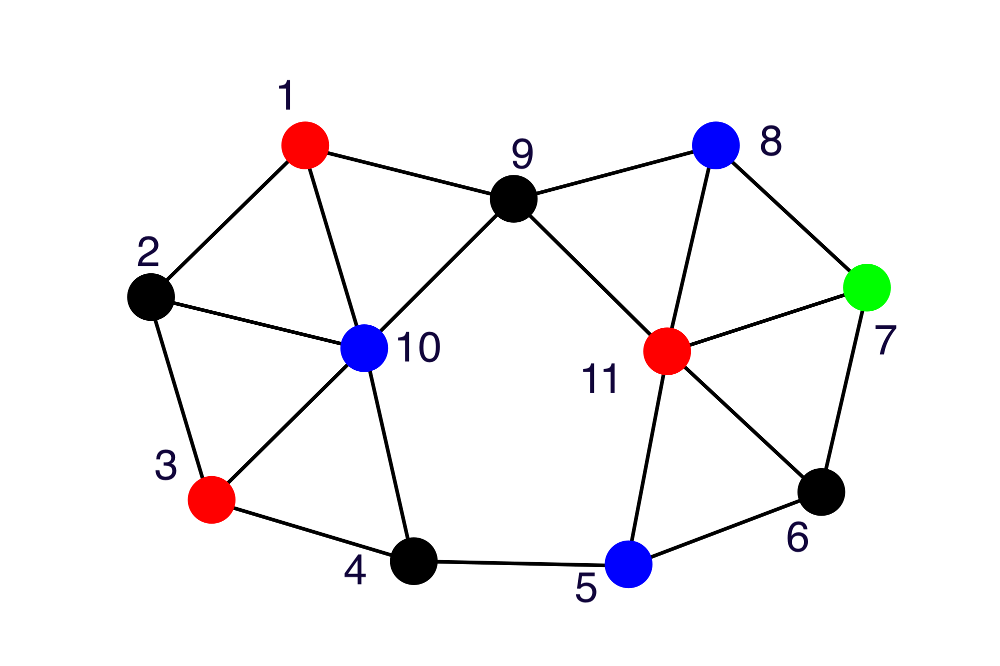

# CS 107 Project 3 -- Graphs, Colors, and Paths

For this project, you will be implementing a variety of algorithms
that deal with graph colorability. A graph is a data structure
consisting of nodes and edges. Here's a picture of a graph:

Each of the little circles is a node, and each one of the lines is an
edges. Each node has a label (an integer ID, in this case), along with
a *color*. Normal graphs (that you'll see most places) don't
necessarily have colors, that's an addon for this project.

Technically, the set of graphs can be thought in a few different
ways. For this project, I'm going to use the adjacency-list
representation:

    Graph ⊆ ℘(Node) × ℘(Edge)
    Node ≡ ℕ
    Edge ≡ Node × Node

In other words, a graph is a pair of a set of nodes and a set of
edges. A node is just a number, and an edge is a pair of nodes.

### Tuples in Python

[Tuples](https://en.wikipedia.org/wiki/Tuple) generalize pairs, and
can be written in Python using syntax akin to that of ordered pairs
from our algebra classes:

    (1,2)
    (1,2,3)
    (1,2,3,4)

They can be indexed in the same way that Python lists / arrays are
indexed:

    >>> (1,2,3)[1]
    2

## Graphs in Python

A graph is a mathematical construct, but when we choose to implement
it in Python, there are a rich variety of ways that we can choose to
implement the graph. In this assignment, we'll stick to the natural
representation that you would come up with from the definition above:
a graph is a pair (two-tuple) of a list of nodes and a list of edges.

So, for example, a sample graph looks like this:

    g1 = ([1,2], [(1,1), (2,2), (1,2)])

In this assignment, we will be working with *undirected* graphs,
meaning that if there is an edge from node `1` to node `2` (as in the
above example), there is also an edge from node `2` to node `1`.

#### Tasks 1 & 2: `isNeighbor` and `getNeighbors`

We say that two nodes `n₁` and `n₂` are *neighbors* if there is an
edge between `n₁` and `n₂`.

You will write two functions: `isNeighbor` and `getNeighbors`:

- (5 points) The `isNeighbor(g,n1,n2)` function will return `True` if
  and only if nodes `n1` and `n2` are neighbors in graph `g`. This
  function must consider the fact that the graphs are undirected. For
  example, `isNeighbor(g1, 2, 1)` should return `True`.

- (5 points) The function `getNeighbors(g,n)` will return a list
  representing the set of immediate neighbors for a given node. For a
  given node `n₁`, this is the set of nodes `⎨ n₁ ∣ n₁ ∈ g ∧
  isNeighbor(g, n₁, n₂) == True`. For example `getNeighbors(g1,1)`
  should return `[1,2]`.

### Graph Coloring

A graph coloring is an assignment of a "color" to each node. For
example, in the above graph, node 1 has been assigned the color red,
and node 10 has been colored blue. We will represent colors as strings
in Python. We will represent colorings as lists of pairs, where the
first element of the pair is the node number, and the second element
is a string representing the color.

    [(1, "red"), (2, "blue")]

I am going to say that a coloring is "consistent" for a graph, `g`,
when the coloring:

  - Includes *exactly one* coloring for each node in the graph
  - Includes no edges not in the graph

For example, for the above graph, a coloring including
`[...,(1,"red"), (1,"blue")]` would not be consistent because the
coloring included both red and blue colors for node 1.

Colorings assign colors to each node in the graph. A coloring is
"valid" if no two adjacent nodes have the same color. Back in 1852,
someone realized that when you were coloring a map (say of Europe),
you only needed four colors. This is known as the [four color
theorem](https://en.wikipedia.org/wiki/Four_color_theorem). This
result holds holds for a certain class of graphs that represent maps
we can draw in two dimensions (the so-called "planar" graphs).

We say that a graph is **k-colorable** whenever it has some valid
coloring with at most `k` colors. Deciding whether or not a graph is
k-colorable is a very hard problem to solve: there is no known
algorithm that can do so efficiently (we will talk about what this
means towards the end of the course). However, deciding if a specific
coloring is valid is much easier.

Conceptually, checking whether a coloring is valid involves walking
through each node of the graph `n`, looking up the color of `n`'s
neighbors, and checking that none is the same as the color of
`n`. This is a problem we can tackle with recursive design.

#### Task: `numColors`

- (5 points) Write a function, `numColors(coloring)`, and tells you
  the number of colors present in `coloring`. For example,
  `numColors([(1,"red"),(2,"blue")])` must return `2`.

#### Task: `isConsistent`

- (5 points) Write a function, `isConsistent(g, coloring)`, that takes
  a graph `g`, and a coloring, and decides whether or not the coloring
  is valid for the graph.

#### Task: `isValidColoring(g,coloring)`

- (10 points) Write a function, `isValidColoring(g,coloring)` that
  decides if coloring `coloring` is valid for graph `g`. Specifically,
  your function must return `True` when, for every node `n ∈ g`, all
  nodes `⎨ n₁ ∈ g ∣ isNeighbor(g,n,n₁) ⎬` have a different color than
  `n`.

#### Non-task: `isValidKColoring(g, coloring, k)`

- I have defined this for you in terms of the other functions

## Checking If a Graph is Bipartite

As is typical in computer science, while we can't solve coloring in
general, we *can* solve it in a restricted case. We say that a graph
is *bipartite* when it is 2-colorable. A picture always helps me to
understand this better:

In this graph, you can see how we can divide the nodes in the graph
into two categories 
